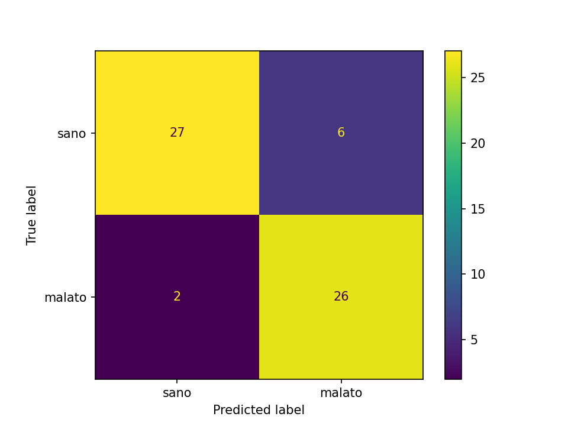
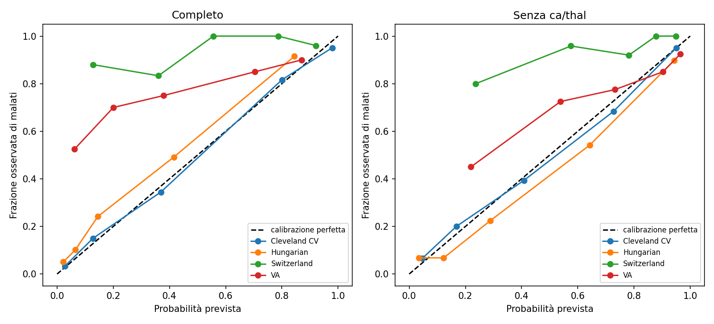

# Predizione di malattie cardiache (Heart Disease UCI)

Classificazione binaria (malattia cardiaca sì/no) sul dataset UCI Heart Disease,
con confronto di modelli, interpretabilità, validazione esterna su tre centri,
analisi di soglia e di calibrazione.

> Progetto di ricerca/portfolio. Non è un dispositivo medico.

## Dati
UCI Machine Learning Repository, *Heart Disease*. Quattro centri:
Cleveland (303 pazienti, usato per addestramento e test), Hungarian (294),
Switzerland (123) e VA Long Beach (200), usati solo per la validazione esterna.
Target: `num` > 0 → malato. In `data/` è inclusa solo `processed.cleveland.data`:
gli altri file vanno scaricati dal repository UCI e copiati in `data/`.

## Struttura
```
src/data.py          caricamento dati e colonne
src/model.py         pipeline (imputazione, scaling, one-hot, modello)
explore.py           esplorazione iniziale
train.py             confronto modelli, test set, interpretabilità
external_val.py      validazione esterna, soglia, calibrazione
tune.py              tuning di C (cross-validation annidata)
train_final.py       addestra e salva il modello finale
predict.py           stima da riga di comando
```

## Metodo
- Pipeline scikit-learn (imputazione mediana/moda, StandardScaler, one-hot per
  `cp`, `restecg`, `slope`, `thal`): le statistiche sono calcolate solo sul
  training, per evitare data leakage.
- Split 80/20 stratificato su Cleveland (242 training, 61 test).
- Confronto di Logistic Regression, Random Forest e Gradient Boosting con
  5-fold stratificata sul solo training set.
- Feature engineering testata: `hr_ratio` (FC massima / FC teorica 220−età),
  `bp_chol`, `oldpeak_exang`.
- Test set usato una sola volta, per il modello scelto.

## Risultati

### Cross-validation (training set, 5-fold)
| Modello | ROC-AUC (base) | Recall (base) | ROC-AUC (base+nuove) | Recall (base+nuove) |
|---|---|---|---|---|
| Logistic Regression | **0.907 ± 0.019** | 0.792 | 0.904 ± 0.024 | 0.784 |
| Random Forest | 0.890 ± 0.029 | 0.764 | 0.883 ± 0.029 | 0.719 |
| Gradient Boosting | 0.854 ± 0.019 | 0.784 | 0.881 ± 0.018 | 0.765 |

Le feature ingegnerizzate non migliorano in modo significativo (differenze
dentro la deviazione standard): si usano le feature originali.

### Test set (Logistic Regression, 61 pazienti)
| Classe | Precision | Recall |
|---|---|---|
| Sano (n=33) | 0.93 | 0.82 |
| Malato (n=28) | 0.81 | 0.93 |

Accuracy 0.87, ROC-AUC 0.958. Il test set è piccolo: una singola predizione
sposta le metriche di diversi punti. La stima più prudente è quella in
cross-validation (AUC 0.91).



## Interpretabilità
Coefficienti della Logistic Regression e permutation importance (ROC-AUC sul
test set) concordano sulle variabili principali:

- `ca` (vasi principali colorati alla fluoroscopia): coefficiente +1.14,
  permutation importance 0.097, circa 3 volte la seconda variabile.
- `cp` (dolore toracico): `cp=4` (asintomatico) aumenta il rischio (+0.96),
  `cp=1` (angina tipica) lo riduce (−0.66). Può sembrare controintuitivo ma è
  un risultato noto in questo dataset: i pazienti inviati all'esame senza
  sintomi tipici hanno spesso una malattia già avanzata.
- `thal`: difetto reversibile (7) aumenta il rischio, perfusione normale (3)
  lo riduce.
- `slope`, `sex`, `thalach` vanno nella direzione clinicamente attesa.

Oltre `ca` e `cp` le differenze di importanza tra variabili sono dentro la
deviazione standard (61 pazienti): l'ordine non va interpretato. I coefficienti
descrivono associazioni, non cause.

## Tuning degli iperparametri
`C` cercato su 11 valori (0.001–100, scala logaritmica) con GridSearchCV
(5-fold) sul solo training set.

- ROC-AUC (CV) tra 0.893 e 0.910, curva piatta per C ≥ 0.03.
- Cross-validation annidata (stessi fold esterni): 0.904 ± 0.051 con tuning,
  0.905 ± 0.051 con C=1.
- Il tuning non migliora in modo rilevabile: si mantiene C=1.

## Validazione esterna
Modello addestrato su Cleveland e applicato senza modifiche agli altri centri.
`ca` è mancante nel 96–99% dei pazienti esterni (`thal` nel 42–90%): per questo
si confronta anche un modello addestrato senza `ca` e `thal`.

ROC-AUC con intervallo di confidenza al 95% (bootstrap, 1000 ricampionamenti):

| Dataset | Completo | Senza ca/thal |
|---|---|---|
| Cleveland (CV) | 0.911 [0.877–0.941] | 0.881 [0.842–0.918] |
| Hungarian | 0.885 [0.842–0.924] | 0.887 [0.840–0.926] |
| Switzerland | 0.746 [0.521–0.920] | 0.776 [0.622–0.915] |
| VA | 0.698 [0.609–0.778] | 0.736 [0.650–0.810] |

Recall e precision con soglia 0.5:

| Dataset | Recall (completo) | Precision (completo) | Recall (senza ca/thal) | Precision (senza ca/thal) |
|---|---|---|---|---|
| Hungarian | 0.660 | 0.854 | 0.745 | 0.767 |
| Switzerland | 0.574 | 0.985 | 0.765 | 0.967 |
| VA | 0.510 | 0.874 | 0.839 | 0.833 |

- Il modello mantiene un buon potere discriminante su Hungarian (AUC ≈ 0.89) e
  uno più modesto su Switzerland e VA.
- Gli intervalli si sovrappongono: le differenze di AUC tra i due modelli non
  sono statisticamente distinguibili.
- Il calo di recall del modello completo è spiegato dalla mancanza di `ca`
  (imputata con la mediana di Cleveland, quindi "nessun vaso colpito").
- Switzerland ha circa 9 pazienti sani: la sua AUC è poco affidabile.

## Soglia di decisione
Soglia scelta su Cleveland (predizioni cross-validate) come la più alta con
recall ≥ 0.90: 0.25 per entrambi i modelli. Applicata senza modifiche ai centri
esterni.

| Modello | Dataset | Recall | Precision | Specificità |
|---|---|---|---|---|
| Completo | Cleveland CV | 0.906 | 0.712 | 0.689 |
| Completo | Hungarian | 0.755 | 0.741 | 0.851 |
| Completo | VA | 0.698 | 0.832 | 0.588 |
| Senza ca/thal | Cleveland CV | 0.914 | 0.672 | 0.622 |
| Senza ca/thal | Hungarian | 0.896 | 0.613 | 0.681 |
| Senza ca/thal | VA | 0.913 | 0.795 | 0.314 |

- Il modello completo non mantiene la recall target fuori da Cleveland
  (0.70–0.82); il modello senza `ca`/`thal` sì (≈ 0.90).
- Il costo è la specificità: per individuare circa 9 malati su 10, il 30–70%
  dei sani risulta positivo, a seconda del centro.
- Switzerland non è riportato (circa 9 sani, specificità non interpretabile).
- La soglia è scelta sulle stesse predizioni usate per valutarla: la stima su
  Cleveland è ottimistica.

## Calibrazione
Brier score e probabilità media prevista contro prevalenza osservata
(curve in `calibration.png`):

| Dataset | Completo: Brier | Prob. media / prevalenza | Senza ca/thal: Brier | Prob. media / prevalenza |
|---|---|---|---|---|
| Cleveland CV | 0.116 | 0.461 / 0.459 | 0.139 | 0.460 / 0.459 |
| Hungarian | 0.127 | 0.299 / 0.361 | 0.125 | 0.407 / 0.361 |
| Switzerland | 0.263 | 0.550 / 0.935 | 0.163 | 0.684 / 0.935 |
| VA | 0.297 | 0.443 / 0.745 | 0.183 | 0.672 / 0.745 |



- Il modello discrimina bene anche fuori da Cleveland, ma le probabilità non
  sono trasferibili: a Switzerland e VA il rischio è sottostimato di molto
  (prevalenza e criteri diagnostici diversi tra centri).
- È la ragione per cui la soglia scelta su Cleveland non si trasferisce,
  soprattutto per il modello completo.
- Su VA il Brier del modello completo è peggiore della sola prevalenza (0.297
  contro 0.190) e quello del modello ridotto è equivalente (0.183).
- Prima di un uso in un nuovo centro servirebbe una ricalibrazione locale.
- Su Switzerland e VA la forma delle curve non è interpretabile (pochi sani).

## Uso
```
pip install -r requirements.txt
python train_final.py
python predict.py --age 63 --sex 1 --cp 1 --trestbps 145 --chol 233 --fbs 1 \
    --restecg 2 --thalach 150 --exang 0 --oldpeak 2.3 --slope 3 --ca 0 --thal 6
```
`ca` e `thal` sono opzionali, ma senza di essi la stima è meno affidabile.
`train_final.py` addestra la Logistic Regression su tutti i